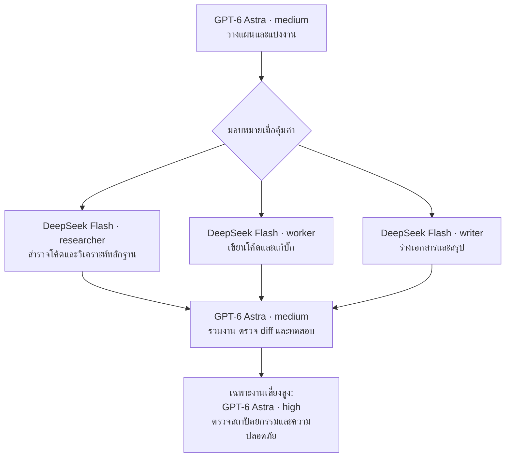

# ProgramMoe — Codex + Astra + DeepSeek Flash

**ให้ Astra วางแผน ให้ Flash ทำงานย่อย แล้วให้ Astra ตรวจผลอีกครั้ง**

ชุดคู่มือและสคริปต์สำหรับ Windows / PowerShell เพื่อใช้ **GPT-6 Astra** เป็นตัวหลักใน Codex และเรียก **DeepSeek Flash** แยกเป็น worker ตามภาพแนวคิด ไม่ใช่แอปแชตหรือโมเดลที่ต้องดาวน์โหลดมารันในเครื่อง

[คู่มือติดตั้งละเอียด / Detailed installation](docs/INSTALL-CODEX-ASTRA-DEEPSEEK.md) · [กฎการแบ่งงาน](AGENTS.md) · [การทดสอบ](docs/TESTING.md)

## รูปแบบการทำงาน



DeepSeek ใช้ `codex exec` คนละ process กับ Astra ไม่ได้เปลี่ยนโมเดลของห้องหลัก และไม่ได้รับประวัติสนทนาหรือรูปภาพจากห้องหลักโดยอัตโนมัติ ค่า API และโควตาของแต่ละผู้ให้บริการแยกกัน วิธีนี้มีเป้าหมายลดการใช้โมเดลราคาแพงกับงานย่อย แต่ไม่ได้รับประกันว่าจะประหยัดทุกงาน

## สิ่งที่ต้องเตรียม

Windows, PowerShell 5.1 ขึ้นไป, Git, Node.js/npm, Codex CLI รุ่นล่าสุด และบัญชีที่ใช้ `gpt-6-astra` ได้ รวมถึง DeepSeek API key ของคุณเอง ส่วน VS Code + Codex extension เป็นทางเลือก

## ติดตั้ง

### 1. ดาวน์โหลดและติดตั้งไฟล์

เปิด PowerShell แล้วรัน:

```powershell
git clone https://github.com/wecmun-afk/programMoe.git
cd programMoe
npm install -g @openai/codex@latest
codex --version
codex login
powershell -NoProfile -ExecutionPolicy Bypass -File .\scripts\install.ps1
```

`ExecutionPolicy Bypass` ในคำสั่งนี้มีผลกับ process ที่เรียกเท่านั้น ไม่ได้เปลี่ยนนโยบายทั้งเครื่อง อ่านสคริปต์ก่อนรันและอย่าฝืนข้อกำหนดขององค์กร

ตัวติดตั้งจะวาง worker, model catalog และ reviewer ใน `$CODEX_HOME` หรือ `$HOME\.codex` หากไม่ได้กำหนดไว้ **ไม่เขียนทับ `config.toml` เดิม ไม่เปลี่ยนข้อมูลล็อกอิน และไม่เรียก API** ส่วนไฟล์ชุดนี้ที่ต้องแทนที่จะสำรองเป็น `.bak` ก่อน

### 2. ตั้งค่า Astra และ API key

เปิด config ของคุณ:

```powershell
$ch = if ($env:CODEX_HOME) { $env:CODEX_HOME } else { Join-Path $HOME '.codex' }
notepad (Join-Path $ch 'config.toml')
```

หากมี config เดิม ให้รวมค่าจาก `config.programmoe.example.toml` อย่างระมัดระวัง โดยให้ค่า root ต่อไปนี้อยู่ก่อนหัวข้อ `[table]` แรก และแก้ค่าที่มีอยู่แทนการเพิ่มซ้ำ:

```toml
model = "gpt-6-astra"
model_provider = "openai"
model_reasoning_effort = "medium"
approval_policy = "on-request"
sandbox_mode = "workspace-write"
```

ตั้ง API key เฉพาะเครื่องคุณโดยไม่พิมพ์ key ลงในคำสั่งที่เก็บใน history:

```powershell
$secret = Read-Host 'DeepSeek API key' -AsSecureString
$credential = New-Object System.Management.Automation.PSCredential('deepseek', $secret)
$env:DEEPSEEK_API_KEY = $credential.GetNetworkCredential().Password
[Environment]::SetEnvironmentVariable('DEEPSEEK_API_KEY', $env:DEEPSEEK_API_KEY, 'User')
Remove-Variable secret, credential
```

จากนั้นปิดและเปิด VS Code/terminal ใหม่ การบันทึกแบบ `User` ทำให้ key คงอยู่ใน environment ของ Windows แต่ **ไม่ใช่ที่เก็บความลับแบบเข้ารหัส** หากต้องการเฉพาะ session นี้ ให้ไม่รันบรรทัด `SetEnvironmentVariable` ห้ามอัปโหลด key, `.env`, `auth.json` หรือ log ที่มีข้อมูลลับ

### 3. ใช้กับโปรเจกต์จริง

คัดลอกหรือรวมเนื้อหา `AGENTS.md` ไปยัง root ของโปรเจกต์ที่จะทำงาน **อย่าเขียนทับกฎเดิมโดยไม่ตรวจ** จากนั้นเปิด PowerShell ใน Git working tree ของโปรเจกต์นั้น:

```powershell
$ch = if ($env:CODEX_HOME) { $env:CODEX_HOME } else { Join-Path $HOME '.codex' }
$launcher = Join-Path $ch 'bin/deepseek-agent.ps1'

# ตรวจพารามิเตอร์โดยไม่เรียก API และไม่ต้องมี key
& $launcher -Role researcher -Task 'Summarize the repository structure.' -DryRun

# ทดสอบจริง: มีการเรียก DeepSeek API และอาจมีค่าใช้จ่าย
& $launcher -Role researcher -Task 'Reply only with: DeepSeek worker OK'

# เปิด Astra เป็นตัวหลัก
codex -m gpt-6-astra -c 'model_reasoning_effort="medium"'
```

หาก PowerShell บล็อกสคริปต์ ให้เรียกผ่าน process เฉพาะคำสั่งตามตัวอย่างในคู่มือละเอียด ไม่ต้องปิดระบบป้องกันทั้งเครื่อง

## ส่งรูปภาพให้ worker

```powershell
& $launcher -Role researcher `
  -Task 'Inspect this screenshot and explain the UI issue. Do not edit files.' `
  -ImagePath '.\screenshots\error.png'
```

สคริปต์ส่ง `--image` พร้อม model catalog ที่ประกาศ `text` และ `image` สำหรับ `deepseek-flash` โดยใช้ catalog นี้เฉพาะ worker ไม่แทนที่รายการโมเดลของ Astra ดูข้อจำกัดและรูปแบบไฟล์จาก [DeepSeek Vision](https://api-docs.deepseek.com/guides/vision)

## คำสั่งเริ่มงานสำหรับ Astra

```text
ทำงานตาม AGENTS.md ก่อนแก้ไขให้วางแผนและระบุไฟล์ที่เกี่ยวข้อง
แบ่งงานที่มีขอบเขตชัดเจนให้ DeepSeek ผ่าน launcher เมื่อคุ้มค่า
ห้ามให้ worker เรียก agent ต่อเอง และห้ามแก้ไฟล์ทับกันพร้อมกัน
หลังรับผลให้ตรวจ diff รวมงาน และรัน test ที่เกี่ยวข้อง
เรียก final_reviewer เฉพาะเมื่อมีความเสี่ยงด้าน architecture/security/data integrity
รายงานสิ่งที่ทำ ผลทดสอบ และข้อจำกัดตามจริง
```

## ข้อจำกัดที่ควรรู้

- `researcher` และ `writer` อ่านอย่างเดียว ส่วน `worker` เขียนใน workspace ได้ Writer ส่งร่างให้ Astra นำไปใช้ ไม่ได้แก้เอกสารเอง
- DeepSeek ปิด built-in web search ในชุดนี้ งานค้นคว้าต้องใช้หลักฐานที่ส่งให้หรือเครื่องมือที่มีอยู่จริง ไม่ใช่การค้นเว็บอัตโนมัติ
- งานเริ่มต้นใช้ DeepSeek reasoning `low`; ใช้ `-ReasoningEffort high` เมื่อจำเป็น ไม่บังคับใช้ Astra high ทุกงาน
- `max_concurrent_threads_per_session` จำกัดเฉพาะ native subagents ไม่ใช่ PowerShell workers ใช้ทีละ worker ก่อน การแยกงานเองยังต้องตรวจความขัดแย้ง
- Sandbox ไม่ได้รับประกันว่าข้อมูลลับหรือ MCP ทุกตัวจะถูกแยกออก ตรวจเครื่องมือที่ตั้งไว้และขออนุญาตเมื่อระบบบล็อก ไม่เปิด full access เพื่อแก้ปัญหาแบบเหมารวม

## แหล่งอ้างอิง

ตรวจเอกสารวันที่ **16 กันยายน 2026**; สิทธิ์บัญชี รุ่น CLI และ API อาจเปลี่ยนได้

- [OpenAI: GPT-6 Astra](https://developers.openai.com/api/docs/models/gpt-6-astra)
- [OpenAI: Codex configuration](https://developers.openai.com/codex/config-reference/)
- [OpenAI: Custom subagents](https://developers.openai.com/codex/subagents/)
- [OpenAI: Codex CLI](https://developers.openai.com/codex/cli/reference/)
- [DeepSeek: Codex integration](https://api-docs.deepseek.com/quick_start/agent_integrations/codex/)
- [DeepSeek: Responses API](https://api-docs.deepseek.com/guides/responses_api/)

Maintained by [ProgramMoe / wecmun-afk](https://github.com/wecmun-afk). ไม่ใช่โครงการทางการของ OpenAI หรือ DeepSeek
